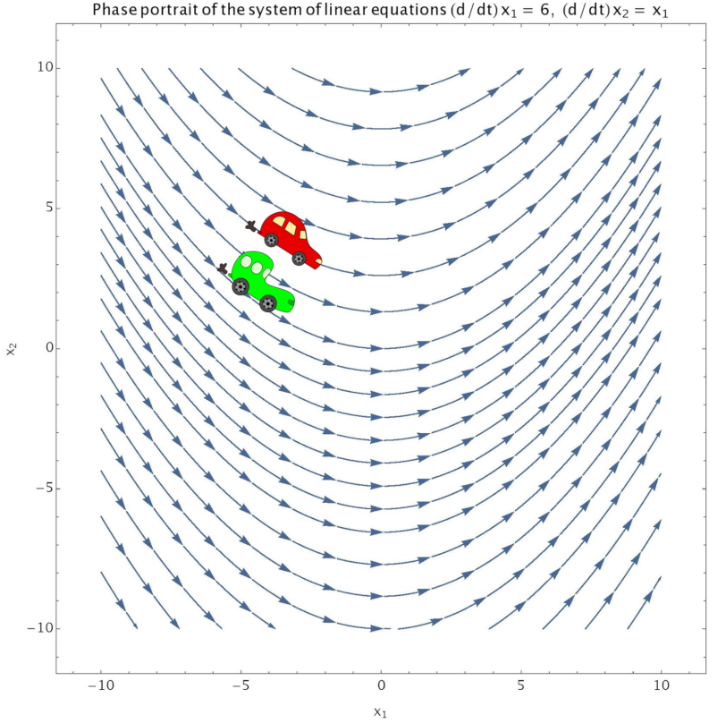

# Differential equations

This chapter was adapted, with minor modifications, from [Chapter
7](https://mathforquantum.quantumtinkerer.tudelft.nl/7_differential_equations_1/)
of the [Mathematics for Quantum
Physics](https://mathforquantum.quantumtinkerer.tudelft.nl/) lecture
notes by Sonia Conesa Boj, Michael Wimmer and others, licensed under
the [CC BY-SA 4.0](http://creativecommons.org/licenses/cc-by-sa/4.0/)
license.

The part about systems of linear first-order differential equations
assumes some knowledge from the chapters on  and
.

(diffeq-first-examples)=
## First examples of differential equations: Definitions and strategies

<iframe width="100%" height=315 src="https://www.youtube-nocookie.com/embed/IUr38H4dcWI?rel=0" frameborder="0" allow="accelerometer; autoplay; encrypted-media; gyroscope; picture-in-picture" allowfullscreen></iframe>

### Definitions

A differential equation (DE) is any equation which involves both a
function and a derivative of that function. In this lecture, we will
be focusing on *ordinary differential equations* (ODEs), meaning that
our equations will involve functions of one independent variable and
hence any derivatives will be full derivatives. Equations which
involve a function of several independent variables and their partial
derivatives are called *partial differential equations* (PDEs); they
will not be treated in this module.

We consider functions $x(t)$ and define $\dot{x}(t)=\frac{dx}{dt}$,
$x^{(n)}(t)=\frac{d^{n}x}{dt^{n}}$. An *$n$-th order differential
equation* is an equation of the form

$$x^{(n)}(t) = f(x^{(n-1)}(t), \cdots, x(t), t).$$

Typically, $n \leq 2$. Such an equation will usually be presented with
a set of initial conditions,

$$x^{(n-1)}(t_{0}) = x^{(n-1)}_{0}, \cdots, x(t_0)=x_0. $$

This is because to fully specify the solution of an $n$-th order
differential equation, $n$ initial conditions are necessary (we need
to specify the value of $n-1$ derivatives of $x(t)$ and as well the
value of the function $x(t)$ for some $t_0$). To understand why we
need initial conditions, look at the following example.

:::{prf:example} Initial conditions

Consider the following calculus problem,

$$\dot{x}(t)=t. $$

By integrating, one finds that the solution to this equation is

$$\frac{1}{2}t^2 + c,$$

where $c$ is an integration constant. In order to specify the
integration constant, an initial condition is needed. For instance, if
we know that when $t=2$ then $x(2)=4$, we can plug this into the
equation to get

$$\frac{1}{2}\cdot 4 + c = 4, $$

which implies $c=2$.

:::

Essentially, initial conditions are needed when solving differential
equations so that the unknowns resulting from integration may be
determined.

:::{admonition} Terminology for differential equations

1. If a differential equation does not explicitly contain the
   independent variable $t$, it is called an *autonomous equation*.

2. If the largest derivative in a differential equation is of the
   first order, i.e. $n=1$, then the equation is called a *first-order
   differential equation*.

3. Often you will see differential equations presented using $y(x)$
   instead of $x(t)$. This is just a different nomenclature.

:::

In this course, we will be focusing on *linear differential
equations*, meaning that we consider differential equations
$x^{(n)}(t) = f(x^{(n-1)}(t), \cdots, x(t), t)$ where the function $f$
is a linear polynomial function of the unknown function $x(t)$. A
simple way to spot a non-linear differential equation is to look for
non-linear terms, such as $x(t) \cdot \dot{x}(t)$ or $x^{(n)}(t) \cdot
x^{(2)}(t)$.

Often, we will be dealing with several coupled differential
equations. In this situation, we can write the entire system of
differential equations as a vector equation, involving a linear
operator. For a system of $m$ equations, denote

$$\vec{x}(t) = \begin{pmatrix}
x_1(t) \\
\vdots \\
x_{m}(t) \\
\end{pmatrix}.$$

A system of first-order linear equations is then written as

$$\dot{\vec{x}}(t) = \vec{f}(\vec{x}(t),t) $$

with the initial condition $\vec{x}(t_0) = \vec{x}_0$.

### Basic examples and strategies for a (single) first-order differential equation

Before focusing on systems of first-order equations, we will first
consider examplary cases of single first-order equations with only one
unknown function $x(t)$.  In this case, we can distinguish important
cases.

#### Type 1: $\dot{x}(t) = f(t)$

The simplest type of differential equation is the type usually learned
about in the integration portion of a calculus course. Such equations
have the form

$$\dot{x}(t) = f(t). $$

When $F(t)$ is an antiderivative of $f(t)$ i.e. $\dot{F}=f$, then the
solutions to this type of equation are

$$x(t) = F(t) + c. $$

:::{admonition} What is the antiderivative?

You may know the antiderivative $F(t)$ of a function $f(t)$ under a
different name - it is the same as the indefinite integral: $F(t) =
\int f(t) dt$. Remember that taking an integral is essentially the
opposite of differentiation, and indeed taking an integral means
finding a function $F(t)$ such that $\dot{F}(t) = \frac{dF}{dt} =
\frac{d}{dt} \int f(t) dt = f(t)$. In the context of differential
equations we prefer to call this the antiderivative as solving the
differential equation means essentially undoing the derivative.

Note that the antiderivative is only defined up to a constant (as is
the indefinite integral).  In practice, you will thus find some
particular expression for $F(t)$ through integration. To capture all
possible solutions, don't forget the integration constant $c$ in the
expression above!

:::

:::{prf:example}

Given the equation

$$\dot{x}(t)=t, $$

one finds by integrating that the solution is $\frac{1}{2}t^2 + c$.

:::

#### Type 2: $\dot{x}(t) = f(x(t))$

The previous example was easy, as the function $x(t)$ did not enter in
the right-hand side.  A second important case that we can solve
explicitly is when the right-hand side is some function of $x(t)$:

$$\dot{x}(t)=f(x(t)).$$

This implies that $\frac{\dot{x}(t)}{f(x)} = 1$. Let $F(x)$ be the
antiderivative of $\frac{1}{f(x)}$. Then, by making use of the chain
rule,

$$\frac{d}{dt} F(x(t)) = \frac{dx}{dt}\,\frac{dF}{dx} = \frac{\dot{x}(t)}{f(x(t))} = 1$$

$$\Leftrightarrow F(x(t)) = t + c.$$

From this, we notice that if we can solve for $x(t)$, then we have the
solution! Having a specific form for the function $f(x)$ can often
make it possible to solve either implicitly or explicitly for the
function $x(t)$.

:::{prf:example}
:label: diffeq-exp

Given the equation

$$\dot{x} = \lambda x, $$

rewrite the equation to be in the form

$$\frac{\dot{x}}{\lambda x} = 1.$$

Now, applying the same process which was shown through just above, let
$f(x)=\lambda x$ and $F(x)$ be the antiderivative of the
$\frac{1}{f(x)}$. Integrating allows us to find the form of this
antiderivative.

$$F(x):= \int \frac{dx}{\lambda x} = \frac{1}{\lambda}\log{\lambda x} $$

Now, making use of the general solution we also have that $F(x(t))
=t+c$.  These two equations can be combined to form an equation for
$x(t)$,

$$\log(\lambda x)  = \lambda t + c$$
$$x(t) = \frac{1}{\lambda} e^c e^{\lambda t} $$
$$x(t) = c_0 e^{\lambda t}$$

where in the last line we defined a new constant $c_0
=\frac{1}{\lambda}e^c$.  Given an initial condition, we could
immediately determine this constant $c_0$.

:::

#### Type 3: $\dot{x}(t) = g(t) f(x(t))$

So far we have considered only DEs where the right-hand side is
either a function of $t$ *or* of $x(t)$. We can still solve a more
generic case, if we can separate the two dependencies as:

$$\dot{x}(t)=g(t)f(x(t)).$$

This type of differential equation is called a first-order
differential equation with non-constant coefficients. If $f(x(t))$ is
linear in $x$ then it is also said to be a linear equation.

This equation can be rewritten to isolate the coefficient function,
$g(t)$:

$$\frac{\dot{x}(t)}{f(x(t))} = g(t). $$

Now, define $F(x)$ to be the antiderivative of $\frac{1}{f(x)}$, and
$G(t)$ to be the antiderivative of $g(t)$. Without showing again the
use of chain rule on the left side of the equation, we have

$$\frac{d}{dt} F(x(t)) = g(t) $$
$$\Rightarrow F(x(t)) = G(t) + c $$

Given this form of a general solution, the knowledge of specific
functions $f$, $g$ would make it possible to solve for $x(t)$.

:::{prf:example}

Let us apply the above strategy to the following equation:

$$\dot{x}= t x^2 .$$

The strategy indicates that we should define $f(x)=x^2$ and $g(t)=t$.
As before, we can re-arrange the equation into the form:

$$\frac{\dot{x}}{x^2} = t. $$

It is then necessary to find $F(x)$, the antiderivative of
$\frac{1}{f(x)}$, or the left hand side of the above equation, as well
as $G(t)$, the antiderivative of $g(t)$, or the right hand side of
the previous equation.

By integrating, one finds

$$F(x) = - \frac{1}{x} $$
$$G(t)=\frac{1}{2}t^2 + c. $$

Accordingly then, the intermediate equation we have is

$$- \frac{1}{x} = \frac{1}{2} t^2 + c. $$

At this point, it is possible to solve for $x(t)$ by re-arrangement

$$x(t)= \frac{-2}{t^2 + c_0}, $$

where in the last line we have defined $c_0 = 2c$. Once again,
specification of an initial condition would enable determination of
$c_0$ directly. To see this, suppose $x(0) = 2$. By inserting this
into the equation for $x(t)$, we get

$$2 = \frac{-2}{c_0} $$
$$ \Rightarrow c_0 = -1.$$

When solved for $c_0$, with the choice of initial condition $x(0)=2$,
the full equation for $x(t)$ becomes

$$x(t)=\frac{-2}{t^2 -1}. $$

:::

:::{prf:example} First-order linear differential equation with general non-constant coefficient function

Let us apply the above strategy of dealing with non-constant
coefficient functions to the more general equation

$$\dot{x}= g(t) \cdot x. $$

This equation suggests that we first define $f(x)=x$ and then find
$F(x)$ and $G(t)$, the antiderivatives of $\frac{1}{f(x)}$ and $g(t)$,
respectively. By doing so, we determine that

$$F(x) = \log(x) \, .$$

Follow the protocol subsequently, we arrive at the equation

$$\log(x) = G(t) + c.$$

Exponentiating and defining $c_0:=e^c$ delivers the equation for
$x(t)$,

$$x(t)= c_0 e^{G(t)} .$$

:::

So far, we have only considered first-order differential equations. If
we consider extending the strategies which we have developed to
higher-order equations such as

$$x^{(2)}(t)=f(x), $$

with f(x) being a linear function, then our work will swiftly become
more tedious. Later on, we will develop a general theory for linear
equations which will enable us to tackle such higher-order
equations. For now, we move on to considering systems of coupled
first-order linear DEs.

(diffeq-theory)=
## Theory of systems of differential equations

<iframe width="100%" height=315 src="https://www.youtube-nocookie.com/embed/4VoSMc08nQA?rel=0" frameborder="0" allow="accelerometer; autoplay; encrypted-media; gyroscope; picture-in-picture" allowfullscreen></iframe>

An intuitive presentation of a system of coupled first-order
differential equations can be given by a phase portrait. Before
demonstrating such a portrait, let us introduce a useful notation for
working with systems of DEs. Several coupled DEs can be written down
concisely as a single vector equation:

$$\dot{\vec{x}}=\vec{f}(\vec{x}). $$

In such an equation, the vector $\dot{\vec{x}}$ is the rate of change
of a vector quantity, for example; the velocity which is the rate of
change of the position vector. The term $\vec{f}(\vec{x})$ describes a
vector field, which has one vector per point $\vec{x}$. This type of
equation can also be extended to include a time varying vector field,
$\vec{f}(\vec{x},t)$.

In the phase portrait below, the velocities of the cars are determined
by the vector field $\vec{f}(\vec{x})$, where their velocity
corresponds to the slope of each arrow. The position of each of the
little cars is determined by an initial condition. Since the field
lines do not cross and the cars begin on different field lines, they
will remain on different field lines.

:::{prf:property} Properties of a system of first-order linear DEs

If $\vec{f}(\vec{x})$ is not *crazy* — for example, if it is
continuous and differentiable — then it is possible to prove the
following two properties for a system of first-order linear DEs:

1. **Existence of solution**: For any specified initial condition,
   there is a solution.

2. **Uniqueness of solution**: Any point $\vec{x}(t)$ is uniquely
	determined by the initial condition and the equation i.e. we know
	where each point "came from" $\vec{x}(t'<t)$.

:::

### Systems of linear first-order differential equations

#### Homogeneous systems

Any homogeneous system of first-order linear DEs can be written in
the form

$$\dot{\vec{x}} = A(t) \vec{x} \, ,$$

where $A$ is a linear operator. The system is called homogeneous
because it does not contain any additional term which is not dependent
on $\vec{x}$ (for example an additive constant or an additional
function depending only on $t$).

:::{admonition} Linearity of a system of DEs

An important property of such a system is *linearity*, which has the
following implications:

1. If $\vec{x}(t)$ is a solution ,then $c \vec{x}(t)$ is a solution too, for any constant $c$.

2. If $\vec{x}(t)$ and $\vec{y}(t)$ are both solutions, then so is $a
\vec{x}(t)+ b \vec{y}(t)$, where $a$ and $b$ are both constants.

:::

These properties have special importance for modelling physical
systems, due to the principle of superposition which is especially
important in quantum physics, as well as electromagnetism and fluid
dynamics. For example, in electromagnetism, when there are four
charges arranged in a square acting on a test charge located within
the square, it is sufficient to sum the individual forces in order to
find the total force. Physically, this is the principle of
superposition, and mathematically, superposition is linearity and
applies to linear models.

:::{admonition} General solution

For a system of $n$ linear first-order DEs with $n \times n$ linear
operator $A(t)$, the general solution can be written as

$$\vec{x}(t) = c_1 \vec{\phi}_1 (t) + c_2 \vec{\phi}_2 (t) + \cdots + c_n \vec{\phi}_n (t),$$

where $\{\vec{\phi}_1 (t), \vec{\phi}_2(t), \cdots, \vec{\phi}_n (t)
\}$ are $n$ independent solutions which form a basis for the solution
space, and $c_1, c_2, \cdots c_n$ are constants.

$\{\vec{\phi}_1 (t), \vec{\phi}_2(t), \cdots, \vec{\phi}_n (t) \}$ are
a basis if and only if they are linearly independent for fixed $t$:

$$\det \big{(}\vec{\phi}_1 (t) | \vec{\phi}_2 (t) | \cdots |
\vec{\phi}_n (t) \big{)} \neq 0.$$

If this condition holds for one $t$, it holds for all $t$.

:::

#### Inhomogeneous systems

Compared to the homogeneous equation, an inhomogeneous equation has an
additional term, which may be a function of the independent variable.

$$ \dot{\vec{x}}(t) = A(t) \vec{x}(t) + \vec{b}(t).$$

:::{admonition} Relation between a solutions of a homogeneous and inhomogeneous equations

There is a simple connection between the general solution of an
inhomogeneous equation and the corresponding homogeneous equation. If
$\vec{\psi}_1$ and $\vec{\psi}_2$ are two solutions of the
inhomogeneous equation, then their difference is a solution of the
homogeneous equation

$$(\dot{\vec{\psi}_1}-\dot{\vec{\psi}_2}) = A(t) (\vec{\psi}_1 - \vec{\psi}_2). $$

The general solution of the inhomogeneous equation can be written in
terms of the basis of solutions for the homogeneous equation, plus one
particular solution to the inhomogeneous equation,

$$\vec{x}(t) = \vec{\psi}(t) + c_1 \vec{\phi}_1 (t) + c_2 \vec{\phi}_2 (t) + \cdots + c_n \vec{\phi}_n (t). $$

In the above equation, $\{\vec{\phi}_1 (t), \vec{\phi}_2(t), \cdots,
\vec{\phi}_n (t) \}$ form a basis for the solution space of the
homogeneous equation and $\vec{\psi}(t)$ is a particular solution of
the inhomogeneous system.

:::

:::{admonition} Strategy of finding the solution of the inhomogeneous equation

Now we need a strategy for finding the solution of the inhomogeneous
equation.  Begin by making an ansatz that $\vec{x}(t)$ can be written
as a linear combination of the basis functions for the homogeneous
system, with coefficients that are functions of the independent
variable.

1. Ansatz:

	$$\vec{x}(t) = c_1(t) \vec{\phi}_1 (t)+ c_2(t) \vec{\phi}_2(t) + \cdots + c_n(t) \vec{\phi}_n (t) $$

2. Define the vector $\vec{c}(t)$ and matrix $\vec{\Phi}(t)$ as

	$$\vec{c}(t) = \begin{pmatrix}
	c_1(t) \\
	\vdots \\
	c_n(t) \\
	\end{pmatrix} $$
	$$\vec{\Phi}(t) = \big{(} \vec{\phi}_1 (t) | \cdots | \vec{\phi}_n (t) \big{)} $$

3. With these definitions, it is possible to rewrite the ansatz for $\vec{x}(t)$,

	$$ \vec{x}(t) = \vec{\Phi}(t) \vec{c}(t).$$

4. Using the Leibniz rule, we then have the following expanded equation,

	$$\dot{\vec{x}}(t) = \dot{\vec{\Phi}}(t) \vec{c}(t) + \vec{\Phi}(t) \dot{\vec{c}}(t).$$

5. Substituting the new expression into the differential equation gives,

	$$\dot{\vec{\Phi}}(t) \vec{c}(t) + \vec{\Phi}(t) \dot{\vec{c}}(t) = A(t) \vec{\Phi}(t) \vec{c}(t) + \vec{b}(t) $$
	$$\vec{\Phi}(t) \dot{\vec{c}}(t) = \vec{b}(t). $$

	In order to cancel terms in the previous line, we made use of the fact that $\vec{\Phi}(t)$ solves the homogeneous equation $\dot{\vec{\Phi}} = A \vec{\Phi}$.

6. By way of inverting and integrating, we can write the equation for the coefficient vector $\vec{c}(t)$

	$$\vec{c}(t) = \int \vec{\Phi}^{-1}(t) \vec{b}(t) dt.$$

7. With access to a concrete form of the coefficient vector, we can then write down the particular solution,

	$$\vec{\psi}(t)= \vec{\Phi}(t) \cdot \int \vec{\Phi}^{-1}(t) \vec{b}(t) dt .$$

:::

:::{prf:example} Inhomogeneous first-order linear differential equation

The technique for solving a system of inhomogeneous equations also
works for a single inhomogeneous equation. Let us apply the technique
to the equation

$$ \dot{x} = \lambda x + a. $$

In this particular inhomogenous equation, the function $g(t)=a$. As
discussed in an earlier example, the solution to the homogenous
equation is $c e^{\lambda t}$. Hence, we define $\phi(t)=e^{\lambda
t}$ and make the ansatz

$$\psi(t) = c(t) e^{\lambda t}. $$

Solving for $c(t)$ results in

$$c(t) = \int e^{- \lambda t} a  dt$$
$$c(t) = - \frac{ a }{\lambda} e^{- \lambda t} $$

Overall then, the solution (which can be easily verified by
substitution) is

$$\psi(t) = - \frac{a}{\lambda}.  $$

:::

(diffeq-linear)=
## Solving homogeneous linear systems with constant coefficients

<iframe width="100%" height=315 src="https://www.youtube-nocookie.com/embed/GGIDjgUpsH8?rel=0" frameborder="0" allow="accelerometer; autoplay; encrypted-media; gyroscope; picture-in-picture" allowfullscreen></iframe>

The type of equation under consideration in this section looks like

$$ \dot{\vec{x}}(t) = A \vec{x}(t),$$

where, throughout this section, $A$ will be a constant matrix. It is
possible to define a formal solution using the *matrix exponential*,
$\vec{x}(t) = e^{A t}$.

:::{prf:definition} Matrix exponential

Before defining the matrix exponential, recall the definition of the
regular exponential function in terms of Taylor series,

$$e^{x} = \overset{\infty}{\underset{n=0}{\Sigma}} \frac{x^n}{n!},$$

in which it is agreed that $0!=1$. The matrix exponential is defined
in exactly the same way, only now instead of taking powers of a number
or function, powers of a matrix are calculated with

$$e^{A} = \overset{\infty}{\underset{n=0}{\Sigma}} \frac{{A}^n}{n!}.$$

It is important to use caution when translating the properties of the
normal exponential function over to the matrix exponential, because
not all of the regular properties hold generally. In particular,

$$e^{X + Y} \neq e^{X} e^{Y},$$

unless it happens that

$$[X, Y] = 0.$$

The necessary condition for this property to hold, stated on the
previous line, is called *commutativity*. Recall that in general,
matrices are not commutative so such a condition is only met for
particular choices of matrices. The property of *non-commutativity*
(what happens when the condition is not met) is of central importance
in the mathematical structure of quantum mechanics. *For example,
mathematically, non-commutativity is responsible for the Heisenberg
uncertainty relations.*

On the other hand, one property that does hold, is that $e^{- A t}$ is
the inverse of the matrix exponential of $A$.

Furthermore, it is possible to derive the derivative of the matrix
exponential by making use of the Taylor series formulation,

$$\begin{aligned}
\frac{d}{dt} e^{A t} &= \frac{d}{dt} \overset{\infty}{\underset{n=0}{\Sigma}} \frac{(A t)^n}{n!} \\
... &= \overset{\infty}{\underset{n=0}{\Sigma}} \frac{1}{n!} \frac{d}{dt} (A t)^n \\
... &= \overset{\infty}{\underset{n=0}{\Sigma}} \frac{n A}{n!}(A t)^{n-1} \\
... &= \overset{\infty}{\underset{n=1}{\Sigma}} \frac{A}{(n-1)!}(A t)^{n-1} \\
... &= \overset{\infty}{\underset{n=0}{\Sigma}} \frac{A}{n!}(A t)^n \\
\frac{d}{dt} e^{A t} &= A e^{A t}.
\end{aligned}$$

:::

Armed with the matrix exponential and its derivative, $\frac{d}{dt}
e^{A t} = A e^{A t}$, it is simple to verify that the matrix
exponential solves the differential equation.

:::{prf:property} Properties of the solution using the matrix exponential

1. The columns of $e^{A t}$ form a basis for the solution space.

2. Accounting for initial conditions, the full solution of the
   equation is $\dot{\vec{x}}(t) = e^{A t} {\vec{x}}_{0}$, with
   initial condition $\vec{x}(0) = e^{A 0}{\vec{x}}_0 = \mathbb{I}
   {\vec{x}}_{0} = {\vec{x}}_{0}$. (here $\mathbb{I}$ is the $n\times
   n$ identity matrix)

:::

Next, we will discuss how to determine a solution in practice, beyond
the formal solution just presented.

### Case 1: $A$ is diagonalizable

For an $n \times n$ matrix $A$, denote the $n$ distinct eigenvectors
as $\{\vec{v}_1, \cdots, \vec{v}_n \}$. By definition, the
eigenvectors satisfy the equation

$$A \vec{v}_i = \lambda_i \vec{v}_i, \qquad \forall i \epsilon \{1, \cdots, n \}. $$

Here, we give consideration to the case of distinct eigenvectors, in
which case the $n$ eigenvectors form a basis for $\mathbb{R}^{n}$.

:::{admonition} Strategy for finding solution when $A$ is diagonizable

1.  To solve the equation $\dot{\vec{x}}(t) = A \vec{x}(t)$, define a set of scalar functions $\{u_{1}(t), \cdots u_{n}(t) \}$ and make the following ansatz:

	$$\vec{\phi}_{i}(t) = u_{i}(t) \vec{v}_{i}.$$

2.  Then, by differentiating,

	$$\dot{\vec{\phi}_i}(t) = \dot{u_i}(t) \vec{v}_{i}.$$

3.  The above equation can be combined with the differential equation for
	$\vec{\phi}_{i}(t)$,

	$$\dot{\vec{\phi}_{i}}(t)=A \vec{\phi}_{i}(t) \, ,$$

	to derive the following equations,

	$$\dot{u_i}(t) \vec{v}_{i} = A u_{i}(t) \vec{v}_{i}$$
	$$\dot{u_i}(t) \vec{v}_{i} = u_{i}(t) \lambda_{i} \vec{v}_{i} $$
	$$\vec{v}_{i} (\dot{u_i}(t) - \lambda_i u_{i}(t)) = 0, $$

	where in the second last line, we make use of the fact that
    $\vec{v}_i$ is an eigenvector of $A$.

4.  The obtained relation implies that

	$$\dot{u_i}(t) = \lambda_i u_{i}(t).$$

	This is a simple differential equation, of the type dealt with in
    the third example.

5.  The solution is found to be

	$$u_{i}(t) = c_i e^{\lambda_i t},$$

	with $c_i$ being a constant.

6.  The general solution is found by adding all $n$ of the solutions
	$\vec{\phi}_{i}(t)$,

	$$\vec{x}(t) = c_{1} e^{\lambda_1 t} \vec{v}_{1} + c_{2} e^{\lambda_2 t} \vec{v}_{2} + \cdots + c_{n} e^{\lambda_n t} \vec{v}_{n}.$$

	and the vectors $\{e^{\lambda_1 t} \vec{v}_{1}, \cdots,
	e^{\lambda_n t} \vec{v}_{n} \}$ form a basis for the solution
	space since $\det(\vec{v}_1 | \cdots | \vec{v}_n) \neq 0$ (the $n$
	eigenvectors are linearly independent).

:::

:::{prf:example} Homogeneous first-order linear system with diagonalizable constant coefficient matrix

Define the matrix

$$A = \begin{pmatrix}
0 & -1 \\
1 & 0
\end{pmatrix},$$

and consider the DE

$$\dot{\vec{x}}(t) = A \vec{x}(t), \quad \vec{x}_0 = \begin{pmatrix}
1 \\
0
\end{pmatrix}. $$

To proceed by following the solution technique, we determine the
eigenvalues of $A$,

$$\det {\begin{pmatrix}
-\lambda & -1 \\
1 & - \lambda \\
\end{pmatrix}} = \lambda^2 + 1 = 0. $$

By solving the characteristic polynomial, one finds the two
eigenvalues $\lambda_{\pm} = \pm i$.

Focusing first on the positive eigenvalue, we can determine the first
eigenvector,

$$\begin{pmatrix}
0 & -1 \\
1 & 0 \\
\end{pmatrix} \begin{pmatrix}
a \\
b\\
\end{pmatrix} = i \begin{pmatrix}
a \\
b \\
\end{pmatrix}.$$

A solution to this eigenvector equation is given by $a=1$, $b=-i$,
altogether implying that

$$\lambda_1=i, \vec{v}_{1} = \begin{pmatrix}
1 \\
-i \\
\end{pmatrix}.$$

As for the second eigenvalue, $\lambda_{2} = -i$, we can solve the
analogous eigenvector equation to determine

$$\vec{v}_{2} = \begin{pmatrix}
1 \\
i \\
\end{pmatrix}.$$

Hence, two independent solutions of the differential equation are:

$$\vec{\phi}_{1} = e^{i t}\begin{pmatrix}
1 \\
-i \\
\end{pmatrix}, \vec{\phi}_{2}  = e^{-i t} \begin{pmatrix}
1 \\
i \\
\end{pmatrix}.$$

Before we can obtain the general solution of the equation, we must
find coefficients for the linear combination of the two solutions
which would satisfy the initial condition. To this end, we must solve:

$$c_1 \vec{\phi}_{1}(t) + c_2 \vec{\phi}_{2}(t) =
\begin{pmatrix}
1 \\
0 \\
\end{pmatrix}$$

$$\begin{pmatrix}
c_1 + c_2 \\
-i c_1 + i c_2 \\
\end{pmatrix} = \begin{pmatrix}
1 \\
0 \\
\end{pmatrix}.$$

The second row of the vector equation for $c_1, c_2$ implies that
$c_1=c_2$.  The first row then implies that $c_1=c_2=\frac{1}{2}$.

Overall then, the general solution of the DE can be summarized

$$\dot{\vec{x}}(t) = \begin{pmatrix}
\frac{1}{2}(e^{i t} + e^{-i t}) \\
\frac{1}{2 i}(e^{i t} - e^{-i t}) \\
\end{pmatrix} = \begin{pmatrix}
\cos(t) \\
\sin(t) \\
\end{pmatrix}. $$

:::

### Case 2: $A$ ($2\times 2$) is defective

In this case, we consider the situation where $\det(A- \lambda I)$ has
a root $\lambda$ with multiplicity 2, but only one eigenvector
$\vec{v}_1$.

:::{prf:example} Matrix with eigenvalue of multiplicity 2 and only a single eigenvector (Part 1)

Consider the matrix

$$A = \begin{pmatrix}
1 & 1 \\
0 & 1 \\
\end{pmatrix}$$

The characteristic polynomial can be found by evaluating

$$\det \big{(} \begin{pmatrix}
1-\lambda & 1 \\
0 & 1-\lambda \\
\end{pmatrix} \big{)} = 0$$
$$(1-\lambda)^2 = 0$$

Hence, the matrix $A$ has the single eigenvalue $\lambda=1$ with
multiplicity 2. As for finding an eigenvector, we solve

$$\begin{pmatrix}
1 & 1 \\
0 & 1 \\
\end{pmatrix} \begin{pmatrix}
a \\
b \\
\end{pmatrix} = \begin{pmatrix}
a \\
b \\
\end{pmatrix}$$
$$\begin{pmatrix}
a+b \\
b \\
\end{pmatrix} = \begin{pmatrix}
a \\
b \\
\end{pmatrix}.$$

These equations, $a+b=a$ and $b=b$ imply that $b=0$ and $a$ can be
chosen arbitrarily, for example as $a=1$. Then, the only eigenvector
is

$$\vec{v}_1 = \begin{pmatrix}
1 \\
0 \\
\end{pmatrix}.$$

:::

What is the problem in this case? Since there are $n$ equations to be
solved and an $n \times n$ linear operator $A$, the solution space for
the equation requires a basis of $n$ solutions. In this case however,
there are $n-1$ eigenvectors, so we cannot use only these eigenvectors
in forming a basis for the solution space.

:::{admonition} Strategy for finding a solution when $A$ ($2\times 2$) is defective

1. Suppose that we have a system of $2$ coupled equations, so that $A$
   is a $2 \times 2$ matrix, which has eigenvalue $\lambda_1$ with
   multiplicity $2$. As in the previous section, we can form one
   solution using the single eigenvector $\vec{v}_1$,

	$$\vec{\phi}_1(t) = e^{\lambda_1 t} \vec{v}_1.$$

2. To determine the second linearly independent solution, make the
   following ansatz:

	$$\vec{\phi}_2(t) = t e^{\lambda_1 t} \vec{v}_1 + e^{\lambda_1 t} \vec{v}_2.$$

3. With this ansatz, it is then necessary to determine an appropriate
   vector $\vec{v}_2$ such that $\vec{\phi}_2(t)$ is really a solution
   of this problem. To achieve that, take the derivative of
   $\vec{\phi}_2(t)$,

	$$\dot{\vec{\phi}_2}(t) = e^{\lambda_1 t} \vec{v}_1 + \lambda_1 t e^{\lambda_1 t} \vec{v}_1 + \lambda_1 e^{\lambda_1 t} \vec{v}_2 $$

4. Also, write the matrix equation for $\vec{\phi}_2(t)$,

	$$A \vec{\phi}_2(t) = A t e^{\lambda_1 t} \vec{v}_1 + A e^{\lambda_1 t} \vec{v}_2 $$
	$$A \vec{\phi}_2(t) = \lambda_1 t e^{\lambda_1 t} \vec{v}_1 + A e^{\lambda_1 t}\vec{v}_2$$

5. Since $\vec{\phi}_2(t)$ must solve the equation
   $\dot{\vec{\phi}_2(t)} = A \vec{\phi}_2(t)$, we can combine and
   simplify the previous equations to write

	$$A \vec{v}_2 - \lambda_1  \vec{v}_2 = \vec{v}_1$$
	$$(A- \lambda_1 I) \vec{v}_2 = \vec{v}_1 $$

6. With this condition, it is possible to write the general solution as

	$$\vec{x}(t) = c_1  e^{\lambda_1 t} \vec{v}_1 + c_2(t e^{\lambda_1 t} \vec{v}_1 + e^{\lambda_1 t} \vec{v}_2).$$

:::

:::{prf:example} Continuation of the example with $A$ defective (Part 2)

Now, our task is to apply the condition derived just above in order to
solve for $\vec{v}_2$,

$$\begin{pmatrix}
1-1 & 1 \\
0 & 1-1 \\
\end{pmatrix} \begin{pmatrix}
a \\
b \\
\end{pmatrix} = \begin{pmatrix}
1 \\
0 \\
\end{pmatrix}$$
$$\begin{pmatrix}
b \\
0 \\
\end{pmatrix} = \begin{pmatrix}
1 \\
0 \\
\end{pmatrix}$$

Hence, $b=1$ and $a$ is undetermined, so may be taken as $a=0$. Then,

$$\vec{v}_{2} = \begin{pmatrix} 0 \\1 \end{pmatrix}.$$

Overall then, the general solution is

$$\vec{x}(t) = c_1 e^t \begin{pmatrix}
1 \\
0 \\
\end{pmatrix} + c_2 e^t \big{(} t \begin{pmatrix}
1 \\
0 \\
\end{pmatrix}  + \begin{pmatrix}
0 \\
1 \\
\end{pmatrix}\big{)}.$$

:::

### Bonus case 3: Higher multiplicity eigenvalues

In this case, we consider the situation where the matrix $A$ has an
eigenvalue $\lambda$ with multiplicity $m>2$, and only one eigenvector
$\vec{v}$ corresponding to $\lambda$, $(A - \lambda
I)\vec{v}=0$. Notice here that $A$ must be at least an $m \times m$
matrix.

To solve such a situation, we will expand upon the result of the
previous section and define the vectors $\vec{v}_2$ through
$\vec{v}_{m}$ by

$$(A- \lambda I) \vec{v}_2 = \vec{v}_1$$
$$\vdots$$
$$(A- \lambda I) \vec{v}_m = \vec{v}_{m-1}.$$

Then, the subset of the basis of solutions corresponding to eigenvalue
$\lambda$ is formed by the vectors

$$\vec{\phi}_{k}(t) = e^{\lambda t} \big{(} \frac{t^{k-1}}{(k-1)!}\vec{v}_1 + \cdots + t \vec{v}_{k-1} + \vec{v}_{k} \big{)} \quad \forall k \epsilon \{1, \cdots, m \}.$$

To prove this, first take the derivative of $\vec{\phi}_{k}(t)$,

$$\dot{\vec{\phi}_{k}(t)} = \lambda \vec{\phi}_{k}(t) + e^{\lambda t} \big{(} \frac{t^{k-2}}{(k-2)!}\vec{v}_1 + \cdots + \vec{v}_{k-1} \big{)}.$$

Then, for comparison, multiply $\vec{\phi}_k(t)$ by $A$

$$\begin{aligned}
A \vec{\phi}_k (t) &= e^{\lambda t} \big{(} \frac{t^{k-1}}{(k-1)!}\lambda \vec{v}_1 + \frac{t^{k-2}}{(k-2)!} A \vec{v}_2 + \cdots + A \vec{v}_{k-1} + A \vec{v}_k \big{)}\\
&= \lambda \vec{\phi}_k (t) + e^{\lambda t} \big{(} \frac{t^{k-2}}{(k-2)!}(A- \lambda I)\vec{v}_2 + \cdots + t (A- \lambda I)\vec{v}_{k-1} + (A- \lambda I)\vec{v}_{k}  \big{)}\\
&=  \lambda \vec{\phi}_k (t) + e^{\lambda t} \big{(} \frac{t^{k-2}}{(k-2)!} \vec{v}_1 + \cdots + t \vec{v}_{k-2} + \vec{v}_{k-1} \big{)}\\
&= \dot{\vec{\phi}}_{k}(t).
\end{aligned}$$

Notice that in the second last line we made use of the relations
$(A- \lambda I)\vec{v}_{i} = \vec{v}_{i-1}$.

This completes the proof since we have demonstrated that
$\vec{\phi}_{k}(t)$ is a solution of the DE.

***

## Exercises

:::{exercise}
Solve the following differential equations:

(a)  $\dot{x}(t) = t^4$

(b)  $\dot{x}(t) = \sin(t)$
:::

:::{exercise}
Solve, subject to the initial condition $x(0)=\frac{1}{2}$:

(a) $\dot{x}(t) = x^2$

(b) $\dot{x}(t) = t x$

(c) $\dot{x}(t) = t x^{4}$

:::

:::{exercise}
Solve, subject to the given initial condition:

(a) $\dot{x}(t)=-\tan(x)\sin(x)$, subject to $x(0)=1$.

(b) $\dot{x}(t)=\frac{1}{3} x^2+3$, subject to $x(0)=3$.

Hint: it is fine if you use a computer algebra program to solve
the integrals for these problems.

:::

:::{exercise}
Solve the following equation and list all possible solutions:

$$\dot{x}=\cos^2(x)$$

Hint: $\int \frac{1}{\cos^2(x)} dx = \tan(x) $

:::

:::{exercise}
Identify which of the following systems of equations is linear (*you do not need to solve them!*):

(a)	$\begin{cases}
\dot{x}_1 = t x_1 -t x_2,\\
\dot{x}_2 = x_1 x_2 - x_2
\end{cases}$

(b) $\begin{cases}
\dot{x}_1 = e^{-t}x_1\\
\dot{x}_2 = \sqrt{t + \cos(t)-1}x_1 + \frac{\sin(t)}{t^2+t-1}x_2
\end{cases}$

(c) $\begin{cases}
x^{(2)}_1 x_1 + \dot{x}_1 = 8 x_2\\
\dot{x}_2=5tx_2 + x_1
\end{cases}$

:::

:::{exercise}
Take the system of equations:

$$
\begin{cases}
\dot{x}_1 = \frac{1}{2} (t-1)x_1 + \frac{1}{2} (t+1)x_2\\
\dot{x}_2 = \frac{1}{2}(t+1)x_1 + \frac{1}{2}(t-1)x_2.
\end{cases}
$$

Show that

$$\vec{\Phi}_1(t) = \begin{pmatrix}
e^{- t} \\
-e^{- t} \\
\end{pmatrix}$$

and

$$\vec{\Phi}_2(t)=\begin{pmatrix}
e^{\frac{1}{2}(t^2)} \\
e^{\frac{1}{2}(t^2)} \\
\end{pmatrix}$$

constitute a basis for the solution space of this system of
equations.  To this end, first verify that they are indeed
solutions and then that they form a basis.

:::

:::{exercise}
Take the system of equations:

$$
\begin{cases}
\dot{x}_1=x_1\\
\dot{x}_2=x_1.
\end{cases}
$$

Rewrite this system of equations into the general form

$$\dot{\vec{x}} = A \vec{x}$$

and then find the general solution. Specify the general solution
for the following initial conditions:

(a) $\vec{x}(0) = \begin{pmatrix}
1 \\
0 \\
\end{pmatrix}$

(b) $\vec{x}(0) = \begin{pmatrix}
0 \\
1 \\
\end{pmatrix}$

:::

:::{exercise}
Find the general solution of

$$\begin{pmatrix}
\dot{x}_1 \\
\dot{x}_2 \\
\dot{x}_3 \\
\end{pmatrix} = \begin{pmatrix}
1 & 1 & 0 \\
1 & 1 & 0 \\
0 & 0 & 3 \\
\end{pmatrix} \begin{pmatrix}
x_1 \\
x_2 \\
x_3 \\
\end{pmatrix}.$$

Then, specify the solution for the initial conditions

(a) $\begin{pmatrix}
0 \\
0 \\
1 \\
\end{pmatrix}$

(b) $\begin{pmatrix}
1 \\
0 \\
0 \\
\end{pmatrix}$
:::

:::{exercise}
Find the general solution of the system of equations:

$$
\begin{cases}
\dot{x}_1 = 3 x_1 + x_2\\
\dot{x}_2 = - x_1 + x_2
\end{cases}
$$
:::
